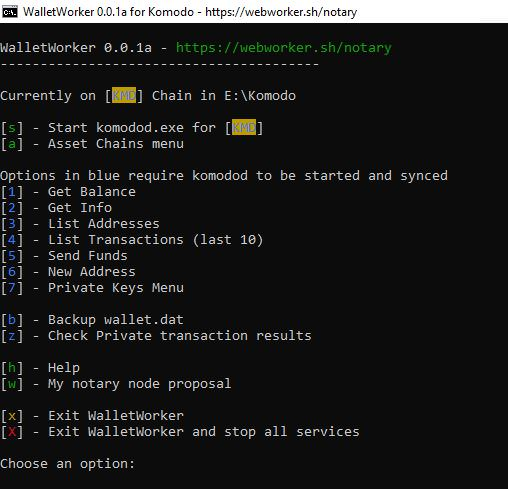

# WalletWorker 0.1.0 for Komodo

By [webworker01](https://webworker.sh/notary)

## What is this?

This is a fancy batch file which creates a lightweight wallet interface for Komodo and all of its assetchains.   It sets up and depends on the "native" blockchains that you wish to operate with.

Best of all it's fully compatible with the excellent [Agama wallet](https://komodoplatform.com/komodo-wallets/)!

I am not planning on implementing SPV(electrum) functionality at this time, if you desire this please use Agama.

[View more screenshots](./screenshots)

## Why did you make this?

I wanted to create something for the Komodo community that I could bring to a useable state within a short amount of time. I also wanted to demonstrate my ability to work with the Komodo blockchain in an easily auditable way.  

While there are certainly limitations to creating a program with a batch file, I was inspired by [DeckerSU's dexscripts.win32](https://github.com/DeckerSU/SuperNET/blob/dev-decker-dev/iguana/dexscripts.win32/how_to_use.md) for BarterDEX and being a script, anyone with some basic capability of reading code can review exactly what the program is doing without trusting in a compiled binary and also learn what goes on under the hood of fancy GUI wallets.   

I was able to complete the initial version in a little over 24 hours of total work which was important for me right in the middle of the notary node elections!

## Features

* **New in 0.1.0** - Collect interest for KMD
* Manual entry of any cli command
* Handles Komodo and all assetchains
* Auto installs and updates from https://artifacts.supernet.org/latest/windows/
* Auto sets up komodo.conf with randomly generated RPC username and password
* If Agama was already installed, can share the same data directory and wallet.dat files
* Output debug messages to console instead of debug.log file so you can see in realtime what komodod is up to
* Configurable data directory - place your data onto a different drive if you wish!
* Create new Transparent and Private addresses
* Send Transparent and Private transactions
* Backup wallet with asset name and timestamp
* Import/export private keys
* Check addresses in your wallet in multiple ways
* Graceful shutdown of daemons to help prevent corruption
* Feel like a hacker using this futuristic text based interface with colors

## How do I install this?

Either git clone this repo or download the zip file and extract its contents anywhere you wish on your computer.

Start walletworker.bat and answer the initial setup prompts. The rest _should_ set up automatically.

## Requirements

Developed and tested on Win10x64 but _should_ work with Windows 7.

Some features use PowerShell 2.0 functions which requires .NET Framework 2.0, but these should be installed with Windows 7 and up.

Any other requirements will come from komodod and komodo-cli, but if all goes well, these will be installed for you when you first start up the bat file.

## I'm having problems or have suggestions!

Please feel free to open an issue on this repo.  Ideally you don't need to, but if you do, maybe double check that there wasn't a similar ticket.

Pull requests are also welcome!

## Potential Future Enhancements

I need to make sure everything is solid with the current features before adding on much more, but some thoughts if there's demand for this program:

* Learning mode - display all RPC calls to the screen so you can see the commands being used
* Better formatting of RPC results
* Wallet.dat encryption (This needs to be tested with Agama, but most likely will cause compatibility issues)
* Possibly  BarterDex integration
* [Bitcoin](https://bitcoin.org) and other BTC compatibles support
* Linux version

## Get in Touch

If you have any questions or comments, please feel free to reach out to me on the Komodo Discord or Telegram @webworker01

## Donate

Any donations go towards general development in the Komodo ecosystem.

Some projects I have been working on:

Komodostats.com  https://komodostats.com
Walletworker     https://github.com/webworker01/walletworker
knomp            https://github.com/webworker01/knomp
Pirate ZZNOMP    https://pirate.komodostats.com

Donate KMD: RWEBo1Yp4uGkeXPi1ZGQARfLPkGmoW1MwY
Donate BTC: 1WEBo1hf1BSnGJvfB3bhyKxPtJvgVWuzM
