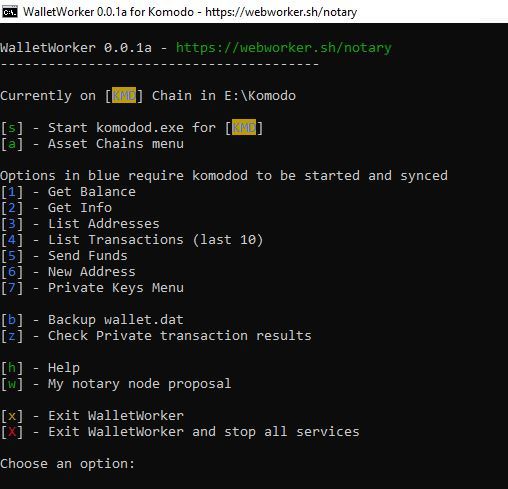

# Screenshots

## Main menu

Here we see the main menu with the main features available with this wallet interface.  I call this a wallet interface because at its core it is simply exposing API features from komodod in a set of menus.

## Asset Chains Menu

You can select any Komodo asset chain and adding new ones are as easily done by adding a new entry to acs.txt

## View all addresses in your wallet

The komodod API provides a few different ways to view addresses in your wallet most of which are exposed here.

Quickly generate a new Transparent or Private address for your wallet!

Backup your wallet files to a few key locations on your system. The files will be automatically labeled and timestamped so keeping multiple backups is super simple.

Control your private keys! Export, Import or Dump them all to a text file if you really want.